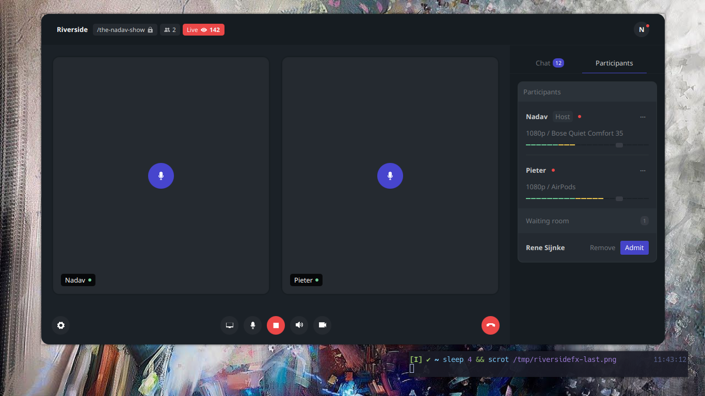

# Riverside JavaFx

An implementation of the **Riverside** web application in JavaFx.

## How to start it

Just clone this repository with
~~~sh
git clone https://github.com/jerryharim/riverside-javafx.git 
cd riverside-javafx
~~~

Then, start the app with :

* **For linux user**
~~~sh
sh run.sh
~~~

* **For Windows user** : 
~~~bat
gradlew.bat run
~~~

